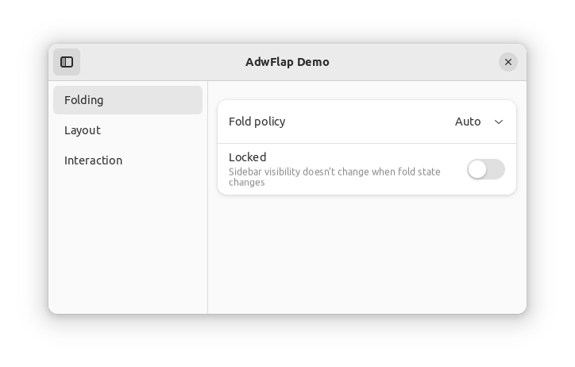
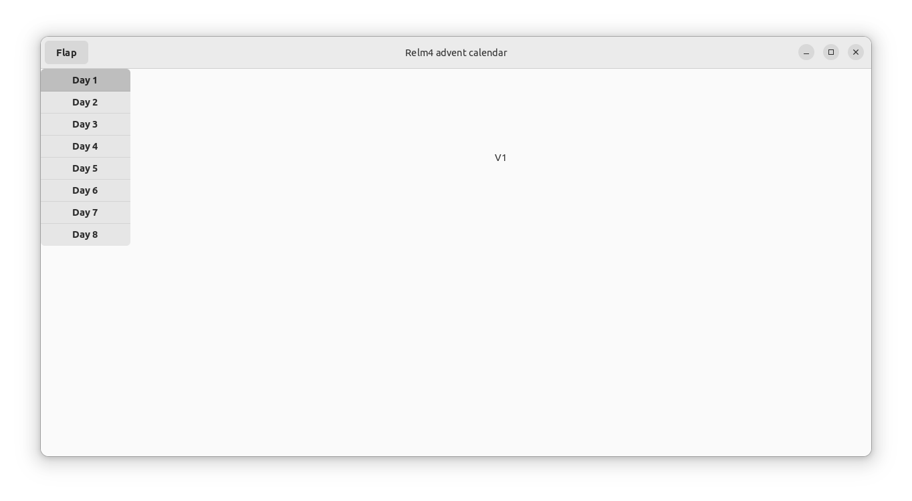
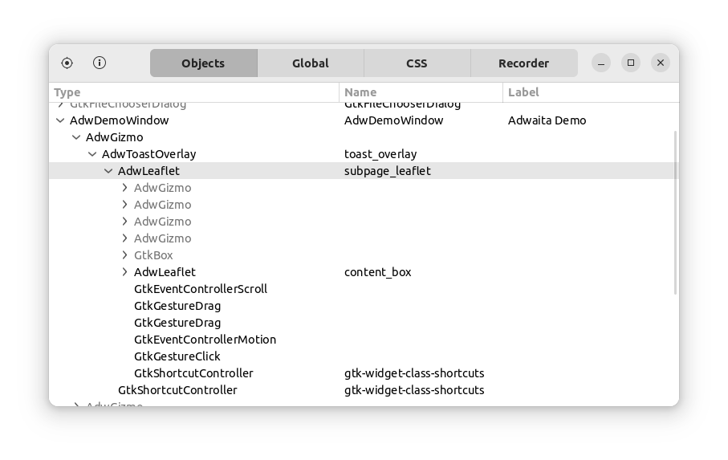
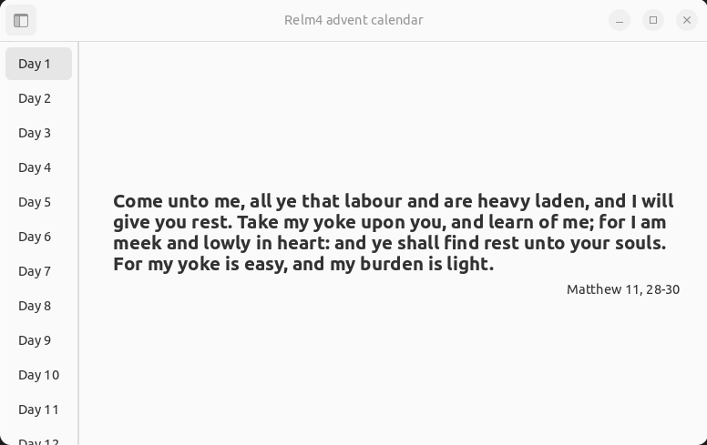

On the evening of the 30th November, I had a few hours to spare and came up with the idea to write a small advent calendar example application for [Relm4](https://github.com/AaronErhardt/relm4).
There wasn't much time left before the first door of the calendar could be opened and I wanted to stay on schedule, so I had to be very quick with the implementation.
That gave me the idea to use this opportunity for a GUI implementation speedrun using Rust.
After all, many wouldn't consider Rust as a good choice for rapid GUI development.

> For those who are unfamiliar with advent calendars: Advent is the time before Christmas and during this time, or more precisely from the first of December until Christmas, an advent calendar has a door for each day. Behind each door there's usually a small gift, a quote or something similar. They are quite popular in many countries (at least in Germany) and most often contain sweets or toys. [Pictures on DuckDuckGo](https://duckduckgo.com/?q=advent+calendar&t=newext&atb=v236-1&iar=images&iax=images&ia=images).

# Figuring out the best strategy

Speedrunning is mostly about having the best strategy.
Being mechanically or physically superior definitely helps in speedruns, too, but strategy has by far the greatest impact.

I found that looking at GUI development from the perspective of speedrunning is very interesting.
It made me more aware of the parts where I lost time and also the parts where I was really quick.
Learning from my mistakes, I think I can improve my strategy in future project and with it my productivity.

## The plan

Before starting to work on a GUI application, you need to have an idea how the UI should look like. The more precise you know what you want, the easier it will be to implement the UI later.

For me, it saves a lot of time to have a look at the layout of other applications instead of coming up with with something completely new. In this case I chose a layout from the libadwaita "flap" demo that has an simple expandable sidebar that allows you to choose the active page, similar to tabs in browser but in a vertical layout.



## Finding the bests widgets

As I wanted to save time, I made the mistake to just pick widgets that sounded like they were doing the right thing. 
However, I've realized over the course of the speedrun that there were better and simpler widgets that I could have used.

For example, I tried using a [ViewSwitcherBar](https://world.pages.gitlab.gnome.org/Rust/libadwaita-rs/stable/latest/docs/libadwaita/struct.ViewSwitcherBar.html) widget as part of my sidebar.
Yet, as the name and the documentation suggest, it's only horizontal and not meant to be used in a sidebar.
This caused me to refactor some part of my UI several times, which cost some time, even though Relm4 makes refactoring the UI very easy and quick.

This image shows an early version, that has a working side bar, yet it doesn't look properly and isn't really recognizable as sidebar. If I knew before that there was a [StackSidebar](https://gtk-rs.org/gtk4-rs/git/docs/gtk4/struct.StackSidebar.html) widget just for this purpose, I had saved a lot of time.



What I learned from this is to spend a bit more time for selecting the best widget. 
The documentation is always a excellent resource and also the demo applications for GTK4 and libadwaita would have helped me if I had a closer look at them.
Of course more experience will also help a lot and trying out new things during a speedrun unsurprisingly didn't turn out to be extremely fast.

# Shortcuts

Shortcuts are an important part of almost every speedrun in games.
They can save time from a few milliseconds to several hours.
The same is true for GUI development.
Knowing the right tools can significantly speed up your workflow by skipping parts that would usually take more time to complete.

## Compiler errors

A benefit of using Rust I often take for granted is the type system and ownership rules that prevent a lot of bugs at compile time.
When using VSCode or GNOME Builder, those errors appear almost instantly in the editor before having to compile the code manually.
This creates a very short feedback loop that allows you to catch and fix errors quickly.

## Writing the UI in pure Rust

Many UI frameworks come with their own UI description language that allows you to specify the UI layout. 
Most commonly, they use a XML-based syntax.

A feature I really love about Relm4 is that you don't need that. Of course you can use GTK's .ui files if you want, but you can also implement the UI using only Rust code.
With the `relm4-macros` crate, you can even use a quite idiomatic syntax for writing your UI that looks very similar to struct definitions.
This allows a faster and more straight forward connection between UI and application logic and eliminates bugs as everything is checked by the compiler.

## Using the inspector

This shortcut is a really powerful feature of GTK. By setting the environment variable `GTK_DEBUG` to `interactive`, GTK will open programs with the built-in inspector. 
In Bash, for example, this can be done like this:

```bash
export GTK_DEBUG=interactive
```

The inspector works very similar to the dev tools in browsers and allows you to find out conveniently why your UI isn't working as expected. You can also modify your UI directly to find the properties you need to adjust in your code.



Also, you can use this to analyse other GTK programs, especially the GTK4 and libadwaita demo applications.
If you find an interesting widget there, just open the inspector from their menu and select the widget you want to know more about.
This makes it easy to find suitable widgets for your applications.

## Using pre-built components

The core of Relm4 can be extended with the `relm4-components` crate. 
It has several pre-built components that integrate nicely into Relm4 and save a lot of time compared to a manual implementation.

Also [libadwaita](https://gitlab.gnome.org/GNOME/libadwaita) provides a lot of really powerful widgets on top GTK4 which saved me a lot of time in my speedrun. And the best part is, that Relm4 and libadwaita work really well together.

## Examples

If a game had the option to start with a pre-defined save state that skips the whole intro with all the unnecessary dialogues, I doubt speedrunners wouldn't use that.
As a developer you wouldn't start from scratch either, but use examples (or code from Stack Overflow 😉) if available.

Relm4 has over 35 examples to choose from.
You can use them either as a starting point or to get inspiration for a certain problem.
In any case, they really save a lot of time.

## Faster builds with mold

I've realized that the Rust compiler is actually very fast, especially for incremental builds. Yet every time I recompiled my application, it took roughly 8 seconds to finish because the linker consumed a lot of time.

With [mold](https://github.com/rui314/mold) I was able to reduce my incremental compile times by factor 7 to only about 1.2 second. With this, it's really fun to play with the code of the UI as you can see the result of your changes almost immediately.

After installing mold, all you need to do is add the prefix `mold -run` to the command you want to run. Most likely this will be 

```bash
mold -run cargo run
```

# Summary

For me, this was a really fun experience.
Of course, I was doing this mostly for fun and not for being competitive, but there were a lot of things I learned and I hope you can, too, learn from my experience.

I think that Rust doesn't deserve its reputation of not being a good choice for UI code.
Not everything in this post was Rust specific, yet I'm confident to say that I was more productive than I would have been in any other language.

Obligatory, the time of my speedrun was 1 hour and 52 minutes (I didn't mentioned every feature in this article though).

### The final result

This is how the result looks like.



If you want to see the code, you can find it [here](https://github.com/AaronErhardt/relm4/blob/main/relm4-examples/libadwaita/examples/advent_calendar.rs). To run it, you can type

```bash
cd relm4-examples/libadwaita/
cargo run --example advent_calendar
```