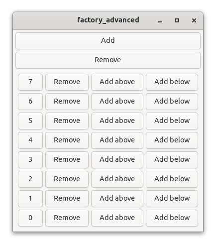

# About

Relm4 is an idiomatic GUI library inspired by [Elm](https://elm-lang.org/) and based on [gtk4-rs](https://crates.io/crates/gtk4). 
It is a new version of [relm](https://github.com/antoyo/relm) that's built from scratch and is compatible with [GTK4](https://www.gtk.org/) and [libadwaita](https://gitlab.gnome.org/GNOME/libadwaita).


## Goals

+ ⏱️ **Productivity:** Writing Relm4 applications should be intuitive and efficient
+ ⚡ **Flexibility:** Anything that’s possible in GTK4 should work well in Relm4, too
+ ✨ **Simplicity:** Writing applications should be as easy and straightforward as possible
+ 🔧 **Maintainability**: The Elm programming model used by Relm4 provides a simple and clear structure for app development


## Platform support

All platforms supported by GTK4 are available for Relm4 as well:

+ Linux
+ Windows
+ MacOS

## Dependencies

I can recommend reading the [gtk4-rs book](https://gtk-rs.org/gtk4-rs/git/book/) for getting more insight into development with GTK4. Yet, knowledge of GTK4 is not required for this book.

+ [How to install GTK4](https://www.gtk.org/docs/installations/)
+ [gtk4-rs book](https://gtk-rs.org/gtk4-rs/git/book/)
+ [gtk4-rs docs](https://gtk-rs.org/gtk4-rs/git/docs/gtk4/index.html)

### Cargo

Add the packages you need to your Cargo.toml:

```toml
gtk = { version = "0.2", package = "gtk4" }
relm4 = "0.1"
relm4-macros = "0.1"
relm4-components = "0.1"
```

# Examples
To get you quickly started, we have prepped some examples to explain the features.
## Screenshots
To wet your appetite, here are some screenshots of of applications you will learn to implement yourself:

|Light Theme | Dark Theme |
|:----:|:----:|
| |  |
| | |
## How to get them

Many code examples in this book can also be found in the [relm4-examples crate](https://github.com/AaronErhardt/relm4/tree/main/relm4-examples). Whenever an example is discussed in the book, the introduction will mention the name of the example and provide a link to it.

To setup the examples run

```bash
git clone https://github.com/AaronErhardt/relm4.git
cd relm4
cd relm4-examples
```

And to run an example, simply type

```
cargo run --example NAME
```

# Issues and feedback

If you find a mistake or something unclear in Relm4 or this book, let me know! Simply open up an issue over at [GitHub](https://github.com/AaronErhardt/relm4/issues) or chat with us on [Matrix](https://matrix.to/#/#relm4:matrix.org).

# Special thanks

I want to thank all contributors of [relm](https://github.com/antoyo/relm) especially [antoyo](https://github.com/antoyo) for building relm that inspired much of the work on Relm4.

Also, I want to thank all contributors of [gtk-rs](https://gtk-rs.org/) that put a lot of effort into the project for creating outstanding Rust bindings for GTK4.

I want to thank [tronta](https://github.com/tronta) for contributing a lot of improvements to this book.
