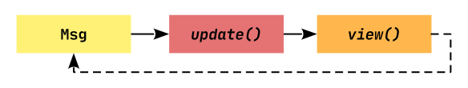

# Your first app

For our first app, let's create something original: A simple counter app.


In this app we will have a counter which can be incremented and decremented by pressing the corresponding buttons.

> The app we will write in this chapter is also available [here](https://github.com/AaronErhardt/relm4/blob/main/relm4-examples/examples/simple_manual.rs). Run `cargo run --example simple_manual` from the [example directory](https://github.com/AaronErhardt/relm4/tree/main/relm4-examples) if you want to see the code in action.

## The basic structure

Relm4 builds on the Elm programming model. This means there are three important data types you need to define:

+ The model type that stores your application state.
+ The message type that defines which messages can be sent to modify the model.
+ The widgets type that stores the GTK widgets (UI elements).

Let's see how we can implement those types for our counter app.

### The model

Our app only needs to store the state of a counter, so a simple `u8` is enough.

```rust,no_run,noplayground
{{#include ../examples/simple_manual.rs:model }}
```

### The message

Now we need to define what messages can be used to modify the model. The message can be represented by any data type, but most often, an `enum` is used. In our case, we just want to increment and decrement the counter.

```rust,no_run,noplayground
{{#include ../examples/simple_manual.rs:msg }}
```

### The widgets

The widgets struct stores the widgets we need to build our user interface. For our app, we can use a window with an increment button, a decrement button and a label to display the counter value. Besides that, we need a box as a container to place our buttons and the label inside because a window can only have one child.

```rust,no_run,noplayground
{{#include ../examples/simple_manual.rs:widgets }}
```

## The Model trait

With our data types in place, we can now implement the model trait. This trait associates a model with other types to reduce the amount of generic parameters in other trait implementations.

There are three types we need to include:

+ Msg: what message type do we use to update the model?
+ Widgets: which struct stores the widgets of our UI?
+ Components: which child components does our model use?

We don't care about components for now because we are just writing a simple app. Therefore, we can use `()` as placeholder.

```rust,no_run,noplayground
{{#include ../examples/simple_manual.rs:model_trait }}
```

## The update loop

As a next step, we want to make our app interactive. Relm4 has two important functions that update state and UI:

+ update: receives a message and modifies the model
+ view: receives the modified model and updates the UI accordingly

Before anything happens, a message must be sent through a channel. Theoretically, anything can send messages, but usually you send messages when a button is clicked or similar events occur. We will have a look at this later.



> Data and widgets are separated from each other: the update function doesn't interact with the widgets and the view function doesn't modify the model.

### The AppUpdate trait

Theory is nice, but let's see it in action.

Our update function is implemented with the `AppUpdate` trait.

```rust,no_run,noplayground
{{#include ../examples/simple_manual.rs:app_update }}
```

> `wrapping_add(1)` and `wrapping_sub(1)` are like `+1`  and `-1` , but don't panic on overflows.

Whenever a new message is sent by our buttons, we process this message here and modify our counter accordingly.

Also, we return `true` because we don't want to quit our application. If our app should close, we can simply return `false` to close the application.

### The Widgets trait

Our last step is implementing the widgets trait. It provides methods to initialize and update the UI.

Let's do this step by step. First, we'll have a look at beginning of the trait `impl`.

```rust,no_run,noplayground
{{#include ../examples/simple_manual.rs:widgets_trait_start }}
```

You'll notice that

+ there are two generic parameters
+ a `Root` type

The two generic parameters are our model and the parent model. The parent model is only used in components which we will discuss later, so again we can simply use `()` as placeholder.

The `Root` type is the root widget of the app. Components can choose this type freely, but the main application must use a `gtk::ApplicationWindow`.

Next up, we want to initialize our UI.

```rust,no_run,noplayground
{{#include ../examples/simple_manual.rs:init_view }}
```

But what exactly happens here?

First, we initialize each of our widgets, mostly by using builder patterns.

Then we connect the widgets so that GTK4 knows how they are related to each other. The buttons and the label are added to the box, and the box is added to the window.

Now the magic happens: we connect the "clicked" event for both buttons and send a message from the closures back to the update loop. To do this, we only need to move a clone of our sender into the closures and send the message.

Alright, now every time we click our buttons a message will be sent to update our counter!

Yet our UI will not updated when the counter is changed. To do this, we need to implement the view function:

```rust,no_run,noplayground
{{#include ../examples/simple_manual.rs:view }}
```

We just need to update the label to represent the new counter value.

We're almost done. To complete the `Widgets` trait we just need to implement the `root_widget` method.

```rust,no_run,noplayground
{{#include ../examples/simple_manual.rs:root_widget }}
```

## Running the App

The last step is to run the app we just wrote. To do so, we just need to initialize our model and pass it into `RelmApp::new()`.

```rust,no_run,noplayground
{{#include ../examples/simple_manual.rs:main }}
```

🎉 Congratulations! You just wrote your first app with Relm4! 🎉

### Conclusion

There are a few concepts in Relm4 that might look complex at first but are actually quite easy to understand and help you keep your code structured. I hope this chapter made everything clear for you :)

If you found a mistake or there was something unclear, please open an issue [here](https://github.com/AaronErhardt/relm4/issues).

As you have seen, initializing the UI was by far the largest part of our app, with roughly one half of the total code. In the next chapter, we will have a look at the relm4-macros crate that offers a macro that helps us to reduce the amount of code we need to implement the Widgets trait.

> As you might have noticed, storing inc_button, dec_button and vbox in our widgets struct is not necessary because GTK will keep them alive automatically. Therefore, we can remove them from `AppWidgets` to avoid compiler warnings.

## The complete code

Let's review our code in one piece one more time to see how all these parts work together:

```rust,no_run,noplayground
{{#include ../examples/simple_manual.rs:all }}
```
